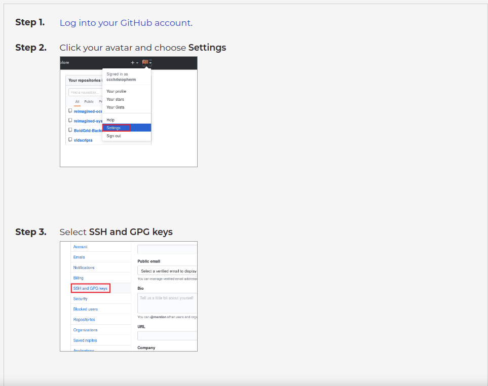
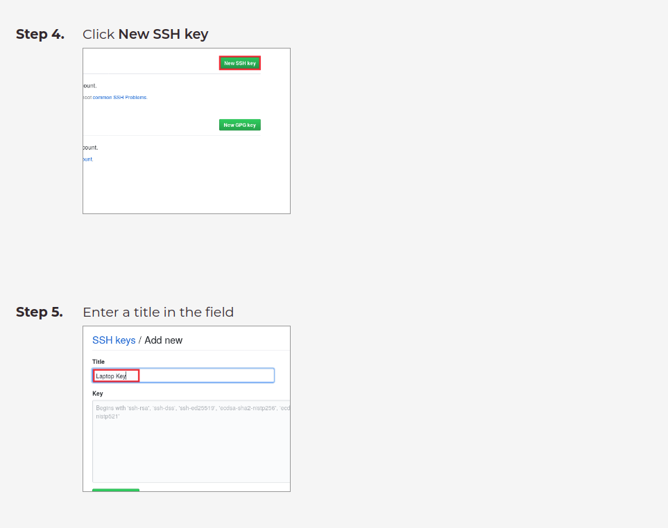
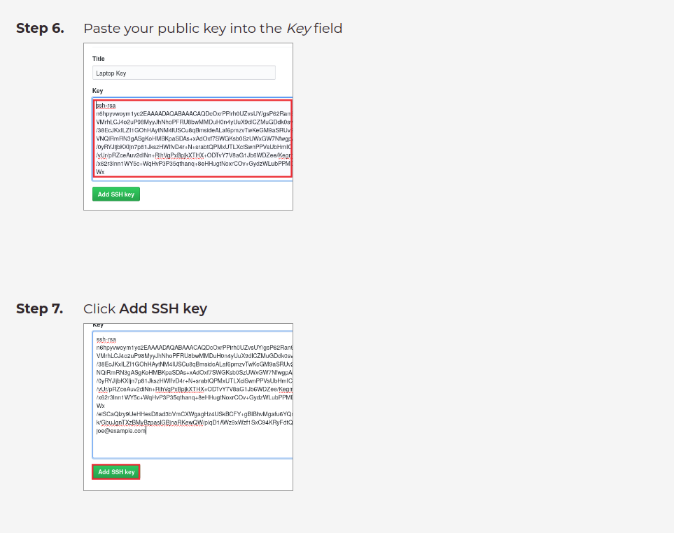

# Git Credential Manager And Automatic SSH Signing

## Git Credential Manager
Git Credential Manager (GCM) is another way to store your credentials securely and connect to GitHub over HTTPS. With GCM, you don't have to manually create and store a personal access token, as GCM manages authentication on your behalf, including 2FA (two-factor authentication).

## Installation
### MacOS

**Homebrew**
    If you have an existing installation of the 'Java GCM' on macOS and you have installed this using Homebrew, this installation will be unlinked (```brew unlink git-credential-manager```) when GCM is installed.

#### Install
```sh
brew install --cask git-credential-manager
```

After installing you can stay up-to-date with new releases by running
```sh
brew upgrade --cask git-credential-manager
```

Or you can directly install it from its installation package found [here](https://github.com/git-ecosystem/git-credential-manager/releases/tag/v2.5.0)

#### Uninstall
To uninstall, run the following command
```sh
brew uninstall --cask git-credential-manager
```

To uninstall installation package use
```sh
sudo /usr/local/share/gcm-core/uninstall.sh
```

### Linux
Download the latest [.deb package*](https://github.com/git-ecosystem/git-credential-manager/releases/tag/v2.5.0), and run the following command
```sh
sudo dpkg -i <path-to-package>
```
```sh
git-credential-manager configure
```
The default credential stores on macOS and Windows are the macOS Keychain and the Windows Credential Manager, respectively.
GCM comes without a default store on Linux distributions.
Some extra configurations are required for all linux distributions.<br>
Here is a list of all credential stores from which you can pick one to use.

- Windows Credential Manager
- DPAPI protected files
- macOS Keychain
- freedesktop.org Secret Service API
- GPG/pass compatible files
- Git's built-in credential cache
- Plaintext files
  
You can select which credential store to use by setting the ```GCM_CREDENTIAL_STORE``` environment variable, or the ```credential.credentialStore``` Git configuration setting. For example
```sh
git config --global credential.credentialStore gpg
```
### Uninstall
```sh
git-credential-manager unconfigure
```
```
sudo dpkg -r gcm
```
## Windows
GCM is included with Git for Windows. During installation you will be asked to select a credential helper, with GCM listed as the default.
Or you can still download the standalone for windows [here](https://github.com/git-ecosystem/git-credential-manager/releases/tag/v2.5.0)

## .Net tools
GCM is available to install as a cross-platform .NET tool. This is the preferred install method for Linux because you can use it to install on any .NET-supported distribution. You can also use this method on macOS if you so choose.

**Note**: Make sure you have installed **version 7.0** of the .NET SDK before attempting to run the following dotnet tool commands. After installing, you will also need to follow the output instructions to add the tools directory to your PATH.

## Usage
### Configuring GCM
After installing Git Credential Manager (GCM), you need to configure it to manage your credentials. Run the following command to configure GCM with Git:
```sh
git-credential-manager configure
```
This command sets up GCM as the default credential manager for Git.
### Using GCM with Git
Once GCM is configured, it will automatically handle credential storage and retrieval for you. When you perform a Git operation that requires authentication, GCM will prompt you to sign in if necessary, and then securely store your credentials.
For example, to clone a repository:
```sh
git clone https://github.com/username/repository.git
```
GCM will prompt you to enter your credentials if they are not already stored.
### Managing Credentials
GCM does not provide a direct command to list or erase credentials. However, you can manage credentials through the specific credential store you are using (e.g., Windows Credential Manager, macOS Keychain, etc.).

#### To erase a specific credential using Git commands:
You can manually remove credentials using the Git credential reject command:
```sh
printf "protocol=https\nhost=github.com\n" | git credential reject
```
This command prompts Git to remove the stored credentials for the specified host.
### Configuring Credential Store
If you need to change the credential store, you can set the GCM_CREDENTIAL_STORE environment variable or use the Git configuration setting credential.credentialStore. For example, to use the GPG credential store:
```sh
git config --global credential.credentialStore gpg
```
### Updating GCM
To keep GCM up to date, use the appropriate update command based on your installation method.

For Homebrew on macOS:
```sh
brew upgrade --cask git-credential-manager
```
For .NET tool:
```sh
dotnet tool update -g git-credential-manager
```
## Automatic SSH Signing
To have git automatically sign stuffs such as commits, here are the steps you will have to follow
- Create and SSH key pair
- Add it to your github account or any other hosted git account.
- Configure Git to begin using the key for verifying signatures

* But before that you should git install, which not in the scope of this article you may check it [here](https://github.com/git-guides/install-git)   
#### Step 1: Creating and SSH key pair
Run ```ssh-keygen -t``` followed by the key type and an optional comment. This comment is included in the .pub file that’s created. You may want to use an email address for the comment. 
For example, for ED25519: 
```ssh-keygen -t ed25519 -C "<comment>"```
For 2048-bit RSA: 
```ssh-keygen -t rsa -b 2048 -C "<comment>"```

Then press ```Enter``` to the following prompts.<br>

.<br>

you can also associate a password to your keys or just press Enter for no password.<br>


#### Step 2: Adding it to your github account




Now that we have added our key to github we can now configure git on our local machine for automatic signing

#### Step 3: Configure git to use the SSH keys for automatic signing
To configure Git to use your key.
```sh
git config --global gpg.format ssh
```
Specify which public SSH key to use as the signing key and change the filename (```~/.ssh/examplekey.pub```) to the location of your key. The filename might differ, depending on how you generated your key: 
```sh
git config --global user.signingkey ~/.ssh/examplekey.pub
```
#### Example try signing a commit if it works
1. Use the -S flag when signing your commits: 
```sh
    git commit -S -m "My commit msg"   
```
2. Optional. If you don’t want to type the -S flag every time you commit, tell Git to sign your commits automatically.
```sh
   git config --global commit.gpgsign true
```
3. If your SSH key is protected, Git prompts you to enter your passphrase. 
4. Push to gitlab or any hosted platform where you added your keys. 
5. Check that your commits are verified. Signature verification uses the allowed_signers file to associate emails and SSH keys. 
   
And your done!, Congrats you just signed your first commit

### Special Cases
#### Working in a Multipass Machine Using SSH
To configure GCM in a Multipass machine using SSH, follow these steps:

1. Install GCM in the Multipass instance:
```sh
multipass exec <instance-name> -- sudo apt-get update
multipass exec <instance-name> -- sudo apt-get install -y git-credential-manager
```
2. Configure GCM in the Multipass instance:
```sh
multipass exec <instance-name> -- git-credential-manager configure
```
3. Ensure SSH key is added:
```sh
multipass exec <instance-name> -- ssh-add ~/.ssh/id_rsa
```
4. Clone a repository:
```sh
multipass exec <instance-name> -- git clone https://github.com/username/name_of_repository
```
#### Working in a Docker Container Using SSH
To configure GCM in a Docker container using SSH, follow these steps:
1. Create a Dockerfile:
```dockerfile
FROM ubuntu:20.04

RUN apt-get update && \
    apt-get install -y git ssh git-credential-manager && \
    git-credential-manager configure

COPY .ssh /root/.ssh
RUN chmod 600 /root/.ssh/id_rsa

CMD ["bash"]
```
2. Build and run the Docker container:
```sh
docker build -t git-gcm-ssh .
docker run -it git-gcm-ssh
```
3. Ensure SSH key is added:
```sh
ssh-add /root/.ssh/id_rsa
```
4. Clone a repository:
```sh
git clone https://github.com/username/name_of_repository
```
